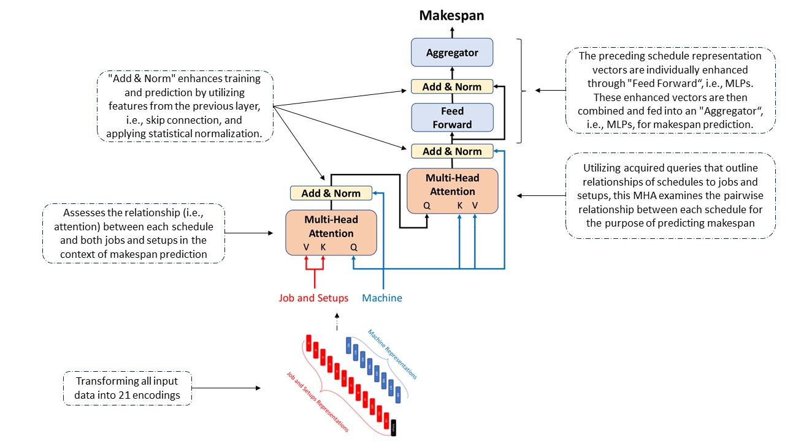

<h2 align="center"><a href="https://ieeexplore.ieee.org/abstract/document/10407811">Deep Learning Enabling Digital Twin Applications in Production Scheduling: <br> Case of Flexible Job Shop Manufacturing Environment</a></h2>

<p align="center">
</p>

This project explores the integration of **deep learning (DL)** within **Digital Twin** environments for **Flexible Job Shop (FJS) Manufacturing Systems**. The goal is to address the computational challenges of running online simulations by using machine learning, particularly DL models, to estimate production metrics efficiently and enable real-time scheduling decisions.  
- The project resulted in a paper that was presented and is in the proceedings of the **2023 Winter Simulation Conference**: [Paper Link](https://ieeexplore.ieee.org/abstract/document/10407811).

### Key Contributions:
- **Deep Learning Meta-Models:** DL architectures based on **Recurrent Neural Networks (RNNs)** and **Attention Mechanisms** are developed to predict key production metrics, particularly **Makespan**. These models allow the Digital Twin system to operate efficiently without relying on resource-heavy simulations.
  
- **RNN + Attention Mechanism:** The combination of RNN and attention mechanisms helps the models capture sequential dependencies and complex interactions within the production system, making them suitable for dynamic and flexible manufacturing environments.

- **Performance:** The DL models demonstrated high accuracy, achieving a **Mean Absolute Percentage Error (MAPE)** of less than 7.4% for Makespan predictions, proving the viability of DL for Digital Twin applications in production scheduling.

### Repository Contents:
This repository contains the implementation of the **DL-based meta-models** that utilize [example **Manufacturing Execution System (MES)** data](https://github.com/ghasemi-amirIE/Digital_Twin_FFS) to facilitate **online and dynamic scheduling** within smart manufacturing systems.

The source code and models are available for exploration and further development. Inquiries should be directed to **yavar.taheri@polimi.it**.

## Citation
Ghasemi, A., Yeganeh, Y. T., Matta, A., Kabak, K. E., & Heavey, C. (2023, December). Deep Learning Enabling Digital Twin Applications in Production Scheduling: Case of Flexible Job Shop Manufacturing Environment. In 2023 Winter Simulation Conference (WSC) (pp. 2148-2159). IEEE. https://ieeexplore.ieee.org/abstract/document/10407811
```
@inproceedings{ghasemi2023deep,
  title={Deep Learning Enabling Digital Twin Applications in Production Scheduling: Case of Flexible Job Shop Manufacturing Environment},
  author={Ghasemi, Amir and Yeganeh, Yavar Taheri and Matta, Andrea and Kabak, Kamil Erkan and Heavey, Cathal},
  booktitle={2023 Winter Simulation Conference (WSC)},
  pages={2148--2159},
  year={2023},
  organization={IEEE}
}
```
