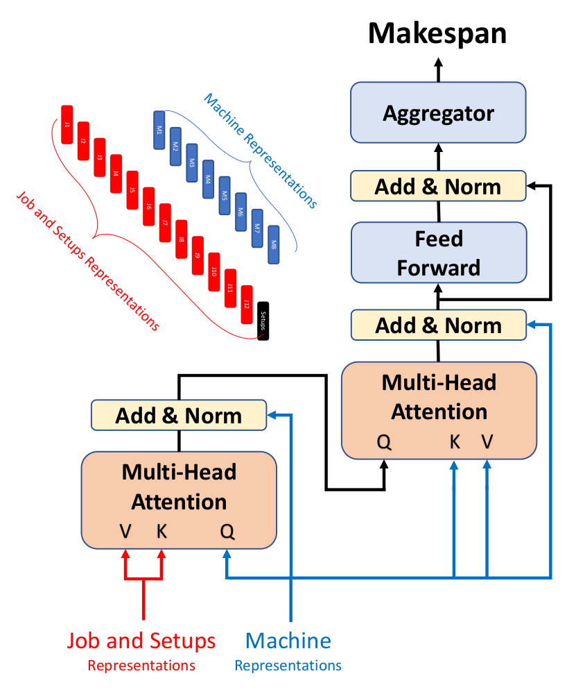

<h2 align="center">Deep Learning for Flexible Job Shop Environment</h2>

## Citation
Ghasemi, A., Yeganeh, Y. T., Matta, A., Kabak, K. E., & Heavey, C. (2023, December). Deep Learning Enabling Digital Twin Applications in Production Scheduling: Case of Flexible Job Shop Manufacturing Environment. In 2023 Winter Simulation Conference (WSC) (pp. 2148-2159). IEEE.  https://dl.acm.org/doi/10.5555/3643142.3643320
